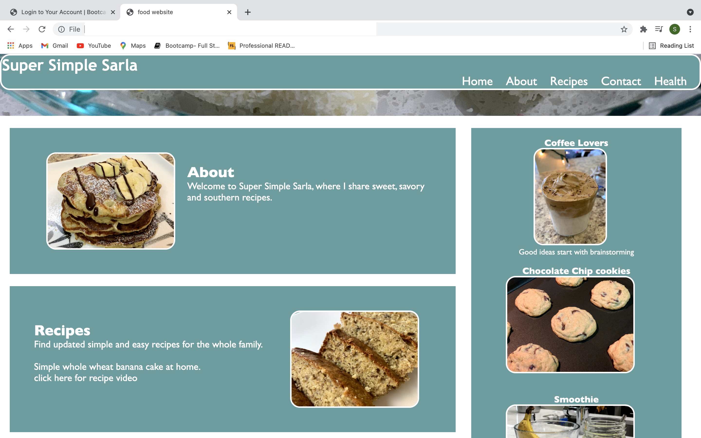
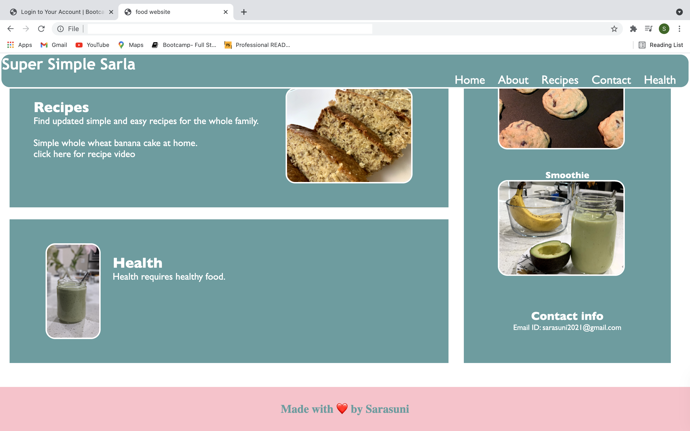

### Name of the Project: ###
Super Simple Sarla

### Description: ###
This is a cooking and baking website for users looking for easy and simple recipes.

### Motivation: ###
As I love to cook, I wanted to share my recipes for the beginners and make it easily accessible over the internet.

### Technologies used: ###
   * HTML
   * CSS
   * Visual Studio Code Editor

### Website Screen Shots: ###

### Website Contents: ###
1. Header contains website title and navigation buttons, which navigates webpage to the associated section.
2. The main body of the webpage contains the following sections:
     * About
     * Recipes
     * Health
     * Contact Info
3. Right side of the webpage contains contact information. 
4. Footer is dedicated to display the website copyright and release information.
